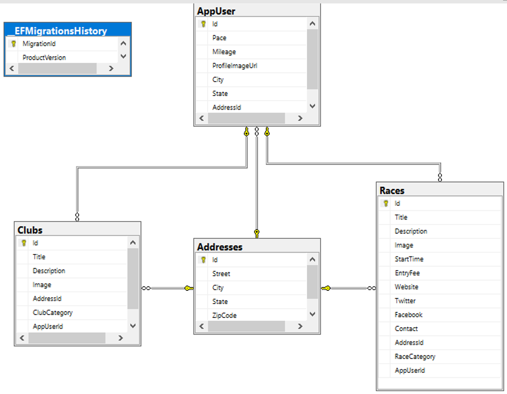
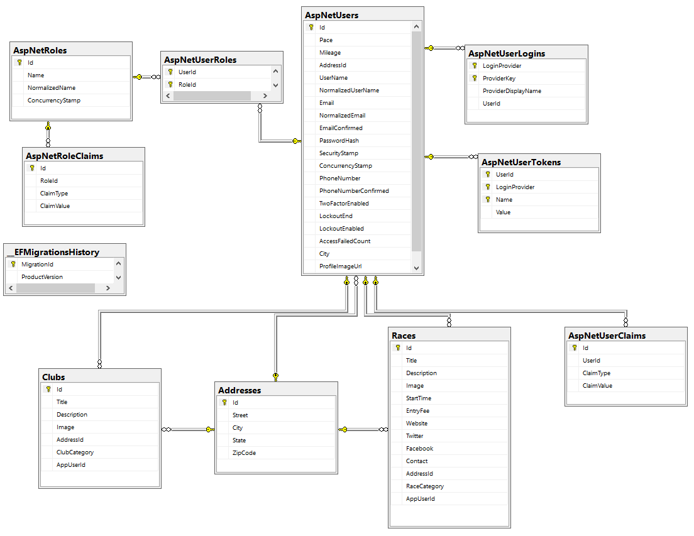
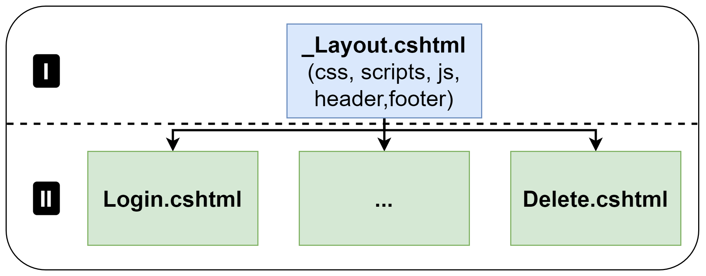

**Key technologies:** *ASP.NET Core NET 7, C#, MVC pattern, Microsoft SQL Server, Entity Framework, Identity Framework (authentification and autorization), Cloudinary, IPinfo, Bootstrap.*
## Website for group runs in your city

## Statring

* Clone the project:  `git clone https://github.com/firstcode6/RunGroupWebApp.git`

* In `flora-stories-editor` folder, run command `docker-compose up -d --build` in the terminal.

## Information
All uploaded images keep in `stories_flora/media`.

Tha same data must be in settings of django in `stories_flora/stories_flora/settings.py`.

Dockerfile run the initial command file `stories_flora/start.sh`, which keeps several important django commands:
- `python manage.py migrate` creates tables and relationships between them from `stories_flora/main_app/models.py` in the database.

## Users
The types of roles are defined in `RunGroupWebApp\Data\UserRoles.cs`. These are two types: admin and user.
- Admin: Only this user has the access to `Dashboatd`. This user is only able to change the status of users. Admin can modify the data. There are no any restrictions; 
- User: This user can modify the data;
The method `SeedUsersAndRolesAsync` provides initial data of roles in file `RunGroupWebApp\Data\Seed.cs`. We call it through `RunGroupWebApp\Program.cs`.

The authorisation is required. It is not possible to operate with website without authorisation . 

Users: 
- Admin: Email: *test@gmail.com*, password: *Coding@1234?*;
- User: Email: *user@etickets.com* password: *Coding@1234?*;

## Database
**The Microsoft SQL Server** is used as DataBase Management System (DBMS).\
The file `docker-compose.yml` keeps the information about the database namely the host, name and password of the database:
- DB_HOST=rungroupdb
- DB_NAME=RunGroups
- DB_SA_PASSWORD=data#123

The method `SeedData` provides initial data in file `RunGroupWebApp\Data\Seed.cs`. We call it through `RunGroupWebApp\Program.cs`.

**Entity Framework** is applied for interactions with database based on Object Relational Mapping (ORM) framework. The settings of Entity Framework in `RunGroupWebApp\RunGroupWebApp\Data\AppDbContext.cs`.
The initial database structure in the image:

**Identity Framework** provides a framework for managing and storing user accounts in ASP.NET Core apps. After implementing this tool, the database changed as follows:

## Cloudinary
Cloudinary(https://cloudinary.com/) is a Software-as-a-Service (SaaS) solution for managing all your web or mobile application's media assets in the cloud.
Cloudinary is utilized for saving uploaded images. The settings are set in `RunGroupWebApp\appsettings.json` and `RunGroupWebApp\Helpers\CloudinarySettings.cs`. The implementation of the interaction is determined in `RunGroupWebApp\Services\PhotoService.cs`

## IP Geo Location
IPinfo (https://ipinfo.io/) is an industry-leading IP data provider that offers IP geolocation, ASN, IP to company, VPN detection, IP ranges, hosted domains, and other data types.
IPinfo provides a free token for getting location based on IP. The settings are set in `RunGroupWebApp\Controllers\HomeController.cs` and `RunGroupWebApp\Helpers\IPInfo.cs`.

## The hierarchy of htmls

## MVC (Model View Controller) Pattern
The **MVC design pattern** specifies that an application consist of a data model, presentation information, and control information.\

**Advantages of MVC:**
- Codes are easy to maintain and they can be extended easily.
- The MVC model component can be tested separately.
- The components of MVC can be developed simultaneously.
- It reduces complexity by dividing an application into three units. Model, view, and controller.
- It supports Test Driven Development (TDD).
- It works well for Web apps that are supported by large teams of web designers and developers.
- This architecture helps to test components independently as all classes and objects are independent of each other
- Search Engine Optimization (SEO) Friendly.\

**Disadvantages of MVC:**
- It is difficult to read, change, test, and reuse this model
- It is not suitable for building small applications.
- The inefficiency of data access in view.
- The framework navigation can be complex as it introduces new layers of abstraction which requires users to adapt to the decomposition criteria of MVC.
- Increased complexity and Inefficiency of data

Based on the current project, a component interaction scheme was created.
.png)
